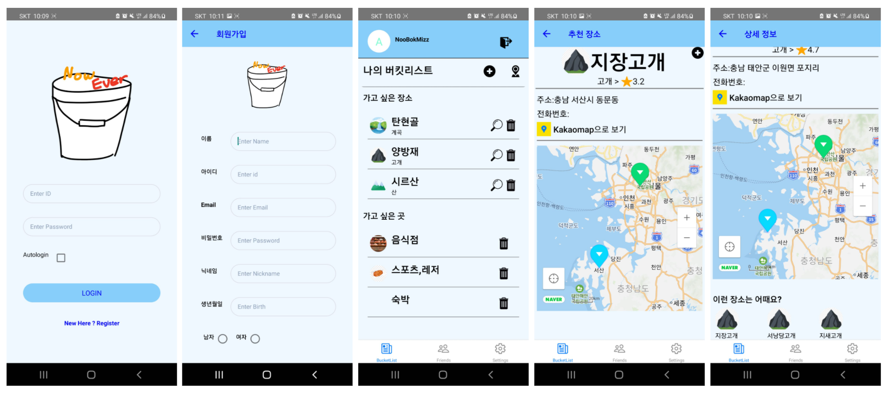
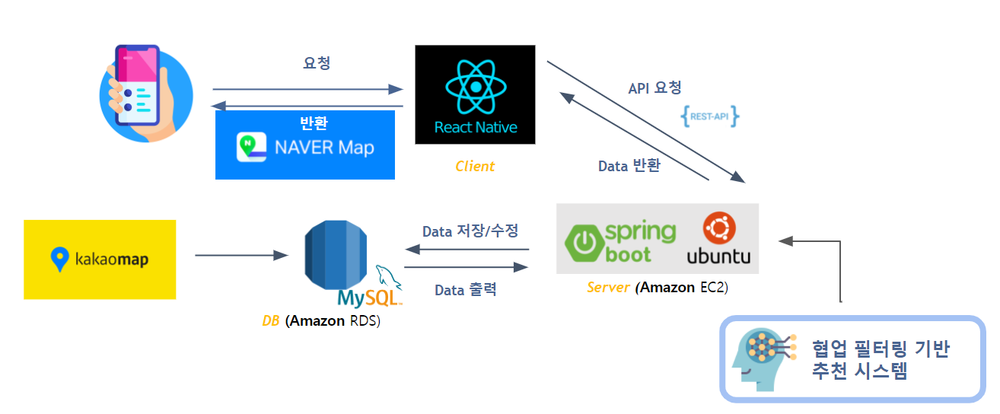
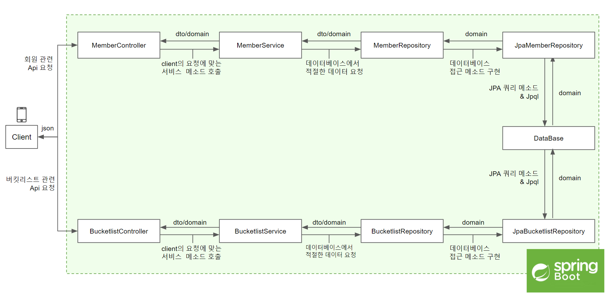

# *Project Name* : **NowOrEver** 📝  

- 프로젝트 개요 : 🙋‍♂️학부 졸업프로젝트로 진행한 모바일 앱 제작 프로젝트  
- 프로젝트 설명 :  
   1. 사용자가 방문하고 싶은 장소나 경험하고 싶은 활동을 앱에 저장 📂  
   2. 기존에 저장해둔 장소와 활동 중 사용자의 현재 위치와 근접한 컨텐츠를 추천 및 정보 출력 🚩    
   3. 유사한 컨텐츠를 함께 추천(협업필터링 기반 추천 시스템) 🥳  
- 프로젝트 구조
  
- 팀원 : 3명
- 프로젝트 기간 : 2021.03.01 ~ 2021.11.26 
- 맡은 파트 : 데이터베이스 설계 및 구축, API 서버 개발, 스프링부트 프로젝트 리팩토링
- 기술 스택  
   - Used Language
      - Java
      - MySQL
   - Used Tech
      - Spring Boot
      - JPA
   - Infra
      - AWS EC2
      - AWS RDS  
  
   
   
 # Spring Boot Project 구조
   
 
  
  
# Project tree
 * [controller](/src/main/java/noobokmizz/noworever/controller) : Member에 대한 요청과 Bucketlist에 대한 요청을 분리해서 처리 
   * [BucketlistController](/src/main/java/noobokmizz/noworever/controller/BucketlistController.java) : Bucketlist에 관한 요청을 처리
   * [MemberController](/src/main/java/noobokmizz/noworever/controller/MemberController.java) : Member에 관한 요청을 처리
*************
 * [service](/src/main/java/noobokmizz/noworever/service) : DB로부터 데이터를 가져와서 요청에 맞게 처리
   * [BucketlistService](/src/main/java/noobokmizz/noworever/service/BucketlistService.java) : Bucketlist에 관한 로직
   * [MemberService](/src/main/java/noobokmizz/noworever/service/MemberService.java) : Member에 관한 로직
*************
 * [repository](/src/main/java/noobokmizz/noworever/repository) : 데이터베이스로부터 필요한 데이터를 가져옴
   * [BucketlistRepository](/src/main/java/noobokmizz/noworever/repository/BucketlistRepository.java) : Bucketlist에 관한 Repostrory(Interface)
   * [JpaBucketlistRepository](/src/main/java/noobokmizz/noworever/repository/JpaBucketlistRepository.java) : Bucketlist에 관한 Repostrory(구현부)
   * [MemberRepository](/src/main/java/noobokmizz/noworever/repository/MemberRepository.java) : Member에 관한 Repostrory(Interface)
   * [JpaMemberRepository](/src/main/java/noobokmizz/noworever/repository/JpaMemberRepository.java) : Member에 관한 Repostrory(구현부)
*************
 * [domain](/src/main/java/noobokmizz/noworever/domain) : 데이터베이스의 테이블과 1대1 맵핑
   * [BKcontents](/src/main/java/noobokmizz/noworever/domain/Bkcontents.java) : Bucketlist 목록 정보
   * [Category_info](/src/main/java/noobokmizz/noworever/domain/Category_info.java) : 활동과 장소를 분류한 카테고리 정보
   * [Location](/src/main/java/noobokmizz/noworever/domain/Location.java) : 장소에 관한 정보
   * [Recommend_location](/src/main/java/noobokmizz/noworever/domain/Recommend_location.java) : (어떤 장소와 유사한) 추천 장소
   * [Review](/src/main/java/noobokmizz/noworever/domain/Review.java) : 장소에 관한 리뷰 정보
   * [Members](/src/main/java/noobokmizz/noworever/domain/Members.java) : 회원에 관한 정보
*************
 * [dto](/src/main/java/noobokmizz/noworever/dto) : 테이블에서 필요한 칼럼만 가져온뒤, 계층간 전송 혹은 반환하는데 사용
   * [Bucketlist](/src/main/java/noobokmizz/noworever/dto/Bucketlist.java)
   * [BucketlistInfo](/src/main/java/noobokmizz/noworever/dto/BucketlistInfo.java)
   * [CategoryAndLocationList](/src/main/java/noobokmizz/noworever/dto/CategoryAndLocationLIst.java)
   * [DefaultResponse](/src/main/java/noobokmizz/noworever/dto/DefaultResponse.java)
   * [Location_info](/src/main/java/noobokmizz/noworever/dto/Location_info.java)
   * [LocationResponse](/src/main/java/noobokmizz/noworever/dto/LocationResponse.java)

